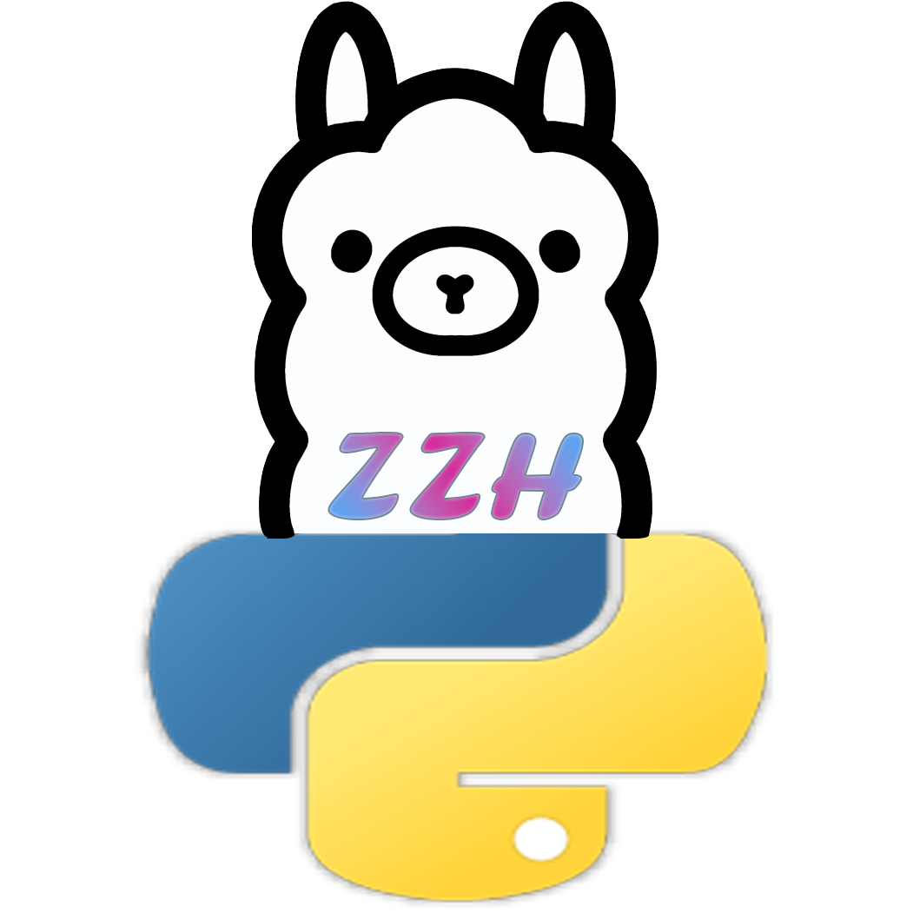
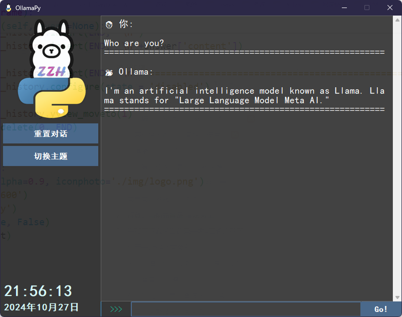
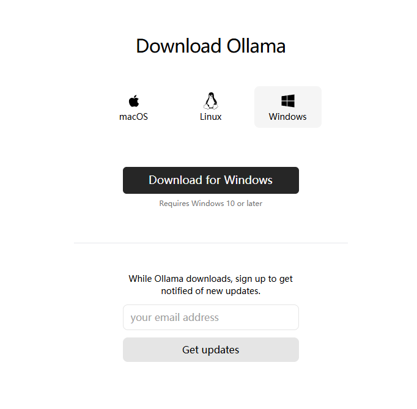
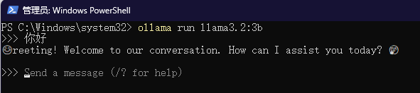

# ollama_py_window

## 羊驼桌面应用 A Desktop Application To Talk with Ollama3.x

实际上就是为了代替 OpenWebUI + Docker。只是一个前端交互工具，仍然需要下载和安装 [Ollama](https://ollama.com/)



## 为什么不用 OpenWebUI + Docker 的方式

Docker 需要虚拟平台功能支持，和华为 eNSP 有冲突必须关掉，但是又要用 eNSP 做实验，还想本地部署 Ollama，所以就没事的时候写了一个。

## 部署方式

### 1.安装 Ollama



### 2.获取 llama3.2:3b 模型

```js
ollama run llama3.2:3b  /* 第一次运行会自动下载 */
```



## 3.运行 app.py


仍然是半成品，先不打包了